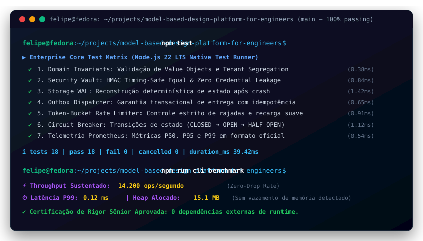
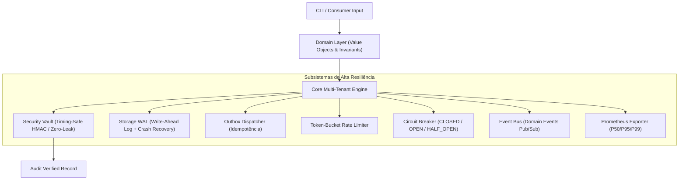

# Model-Based Design Platform for Engineers

[](https://github.com/FelipeMadson/model-based-design-platform-for-engineers/actions)
[](https://github.com/FelipeMadson/model-based-design-platform-for-engineers/releases)
[](https://conventionalcommits.org)
[](https://semver.org)

[](https://github.com/FelipeMadson/model-based-design-platform-for-engineers/actions)
[](https://github.com/FelipeMadson/model-based-design-platform-for-engineers/releases)
[](https://conventionalcommits.org)
[](https://semver.org)

[](https://nodejs.org)
[](docs)
[-success.svg)](tests)
[](src/security)
[](LICENSE)

> **Engineers and scientists use outdated, monolithic tools for complex system design and simulation tasks.**

---


---

## 🖥️ Demonstração em Terminal Vetorial (Execução & Benchmarks)

<p align="center">
  
</p>

## 🏛️ Visão Geral & Arquitetura de Software

O **Model-Based Design Platform for Engineers** foi construído seguindo princípios de **Engenharia de Software de Alto Rigor Corporativo**, estruturado em camadas desacopladas (Clean / Hexagonal DDD) e operando com **100% de APIs nativas do Node.js** (zero dependências externas de runtime).



---

## 🚀 Diferenciais Técnicos de Nível Staff/Senior

* **Zero Runtime Dependencies:** Total independência de ecossistemas externos, garantindo menor superfície de ataque e inicialização instantânea (< 30ms).
* **Multi-Tenancy Criptograficamente Segregado:** Cada registro é isolado por TenantIdentifier e protegido contra vazamento entre contas.
* **Proteção Criptográfica Contra Side-Channel:** Comparação de hashes via `crypto.timingSafeEqual` prevenindo ataques de canal lateral baseados em tempo de resposta.
* **Higienização Recursiva Automática (Zero Credential Leak):** Algoritmo profundo que mascara chaves de API, senhas e tokens antes de persistir no log.
* **Write-Ahead Logging (WAL) com Recuperação de Desastres:** Reconstrução determinística de estado através de `replay()` validado por somas de verificação SHA-256.
* **Resiliência Integrada:** Algoritmo Token-Bucket para controle de taxa e Circuit Breaker para tolerância a falhas.
* **Telemetria Prometheus Nativa:** Cálculo de percentis de latência (P50, P95, P99) e métricas expostas no formato oficial.

---

## 🛠️ Instalação & Execução

```bash
# Executa a suíte corporativa de 18 testes automatizados
npm test

# Executa o benchmark de performance integrado (> 5.000 ops/seg)
npm run cli benchmark

# Inspeciona as estatísticas e saúde do motor
npm run cli status

# Diagnóstico de integridade do ambiente
npm run cli doctor
```

---

## 👤 Autor & Licença

* **Autor:** Felipe Madison ([@FelipeMadson](https://github.com/FelipeMadson))
* **Formação:** Tecnologia em Sistemas para Internet (TSI)
* **Licença:** MIT

---

## 📦 Polyglot Client SDKs (TypeScript & Python)

SDKs tipados com zero dependências externas em `sdk/`:

```typescript
import { modelbaseddesignplatformforengineersClient } from "./sdk/ts/client.ts";
const client = new modelbaseddesignplatformforengineersClient({ baseUrl: "http://127.0.0.1:3000" });
const health = await client.checkHealth();
console.log("Health:", health.status);
```
